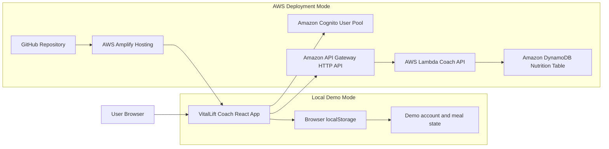
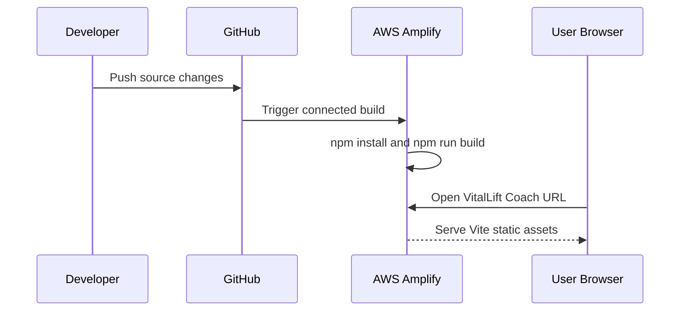
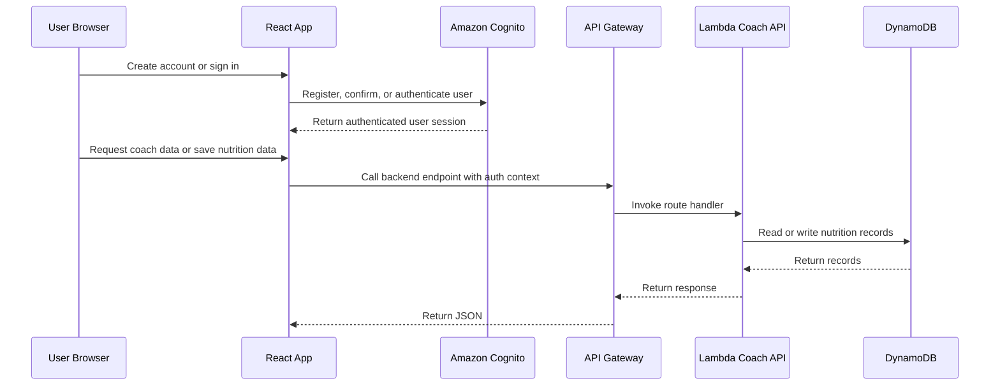

# VitalLift Coach Architecture

This document explains how the current VitalLift Coach prototype is structured and how it is intended to run when deployed on AWS.

## High-Level Diagram



## Runtime Modes

VitalLift Coach currently supports two operating modes.

| Mode | Purpose | Data behavior |
| --- | --- | --- |
| Local demo mode | Lets reviewers test the app immediately on a laptop. | Demo accounts and app state are stored in browser `localStorage`. |
| AWS deployment mode | Enables cloud-backed accounts and backend APIs. | Cognito handles auth, API Gateway routes requests, Lambda runs backend logic, and DynamoDB stores nutrition data. |

The app automatically uses AWS Cognito when these Vite environment variables are configured:

```bash
VITE_AWS_REGION=<your-aws-region>
VITE_COGNITO_USER_POOL_ID=<CognitoUserPoolId>
VITE_COGNITO_USER_POOL_CLIENT_ID=<CognitoUserPoolClientId>
```

Without those variables, the app stays in local demo mode so the interface remains testable.

## AWS Resource Responsibilities

| Resource | Responsibility |
| --- | --- |
| GitHub | Source control for the React app, infrastructure template, and backend placeholder. |
| AWS Amplify Hosting | Builds and hosts the Vite frontend from GitHub using `amplify.yml`. |
| Amazon Cognito | Provides user registration, confirmation, sign-in, and sign-out. |
| Amazon API Gateway HTTP API | Exposes backend routes such as `/health` and `/coach/tip`. |
| AWS Lambda | Runs the backend coach API logic. |
| Amazon DynamoDB | Stores nutrition records by `userId` and `entryId`. |

## Request Flow

### Frontend delivery



### Authenticated app flow



## Current Prototype Boundaries

- The frontend is usable now and includes local demo account behavior.
- Cognito integration is ready once the AWS stack is deployed and env vars are provided.
- The SAM template defines the intended backend resources.
- Meal persistence in DynamoDB is the next backend implementation step.
- Production hardening should include stricter CORS, API authorization, environment-specific configuration, monitoring, and backups.

## Deployment Checklist

1. Connect the GitHub repository to AWS Amplify Hosting.
2. Deploy the backend from `infrastructure/template.yaml` using AWS SAM.
3. Copy SAM outputs into Amplify environment variables.
4. Rebuild Amplify so the frontend receives the Cognito configuration.
5. Test account creation, email confirmation, sign-in, and sign-out.
6. Add authenticated API calls for persistent meals and workout history.
